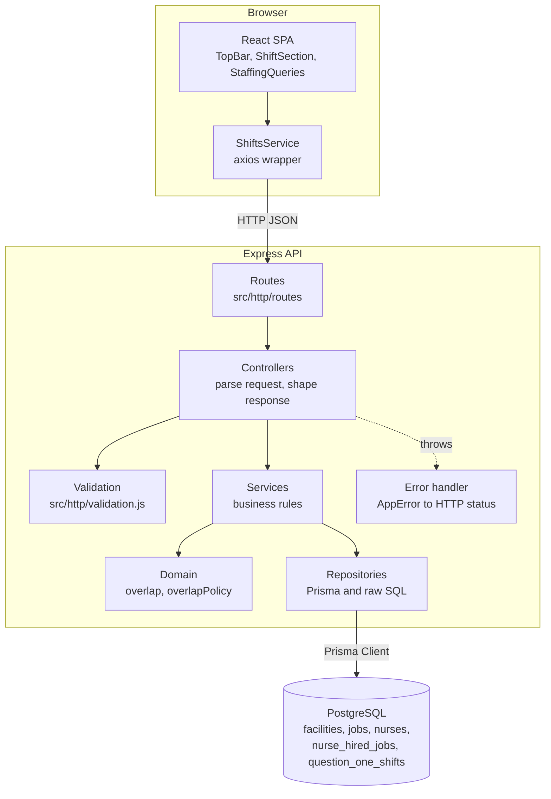
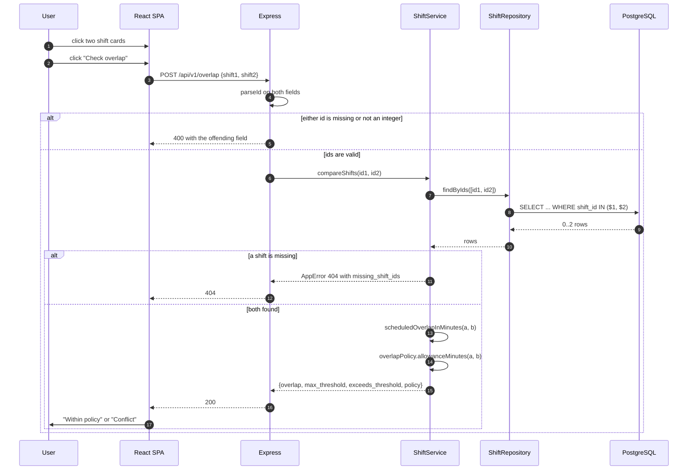

# bravocare - shift overlap and staffing

A small full-stack answer to a nurse-rostering exercise. An Express + Prisma API
over PostgreSQL decides whether two scheduled shifts overlap by more than the
roster allows, and answers three staffing questions about open jobs and which
nurses can fill them. A React single-page app drives it: pick two shifts, get a
verdict, and run each staffing query into a table.

The rule the overlap check enforces is that two shifts at the **same** facility
may overlap by up to a 30 minute handover, while two shifts at **different**
facilities may not overlap at all - nobody can be in two buildings at once. Both
allowances are configurable.

## Screenshots

Captured with Playwright at 1440x900 against the seeded demo database.

Two shifts at the same facility, overlapping by 15 minutes - inside the handover
allowance, so no conflict:


The same 60 minute overlap across two different facilities is a conflict:


Question 4 - how many nurses each open job still needs:


Question 5 - the jobs each nurse is still eligible for:


Real request/response pairs for every endpoint are in
[docs/api-examples.md](docs/api-examples.md).

## Architecture



Dependencies point inward: controllers know services, services know the domain
and the repository interface, and the domain knows nothing at all. `src/app.js`
takes its services as an argument, so the tests build the whole HTTP stack over
in-memory repositories with no database running.

## Workflow

The main flow - selecting two shifts and asking whether they clash:



## Quickstart

With Docker:

```sh
cp .env.example .env          # optional: only POSTGRES_PASSWORD is read from it
docker compose up --build
```

The client is then on <http://localhost:8600> and the API on
<http://localhost:8601>. The `migrate` service applies the migrations and loads
the seed before the API starts.

Without Docker, you need a PostgreSQL 14+ instance:

```sh
# API
cp .env.example .env          # set DATABASE_URL to point at your database
npm install
npm run db:migrate            # apply migrations
npm run db:seed               # load the synthetic demo data
npm start                     # http://localhost:3000

# Client, in a second terminal
cd client
cp .env.example .env.local    # REACT_APP_API_BASE_URL + PORT
npm install
npm start                     # http://localhost:3001
```

## Configuration

API (`.env` in the repository root):

| Variable                                   | Required | Default       | Purpose                                                                               |
| ------------------------------------------ | -------- | ------------- | ------------------------------------------------------------------------------------- |
| `DATABASE_URL`                             | yes      | -             | PostgreSQL connection string used by Prisma.                                          |
| `PORT`                                     | no       | `3000`        | Port the API listens on.                                                              |
| `NODE_ENV`                                 | no       | `development` | `test` silences request logging; `development` adds a `debug` field to 500 responses. |
| `CORS_ORIGIN`                              | no       | `*`           | Browser origin allowed to call the API.                                               |
| `LOG_FORMAT`                               | no       | `dev`         | morgan format: `dev`, `combined`, `common`, `short`, `tiny`.                          |
| `SAME_FACILITY_OVERLAP_ALLOWANCE_MINUTES`  | no       | `30`          | Handover minutes two shifts at one facility may share.                                |
| `CROSS_FACILITY_OVERLAP_ALLOWANCE_MINUTES` | no       | `0`           | Minutes two shifts at different facilities may share.                                 |
| `DEFAULT_PAGE_SIZE`                        | no       | `50`          | Page size when a request does not send `limit`.                                       |
| `MAX_PAGE_SIZE`                            | no       | `200`         | Hard ceiling on `limit`; larger values are clamped, not rejected.                     |

Client (`client/.env.local`):

| Variable                 | Required | Default                         | Purpose                                                                |
| ------------------------ | -------- | ------------------------------- | ---------------------------------------------------------------------- |
| `REACT_APP_API_BASE_URL` | no       | `http://localhost:3000/api/v1/` | Base URL of the API, trailing slash included.                          |
| `PORT`                   | no       | `3000`                          | Dev server port. Set it to `3001` so it does not collide with the API. |

Create React App inlines `REACT_APP_*` at build time, which is why the Docker
image takes the URL as a build argument.

## Development

```sh
npm run dev           # API with nodemon
npm test              # server suite: node:test + supertest
npm run test:client   # client suite: Jest + React Testing Library
npm run lint          # ESLint over the server, the seed, the tests and the client
npm run format        # Prettier
npm run db:seed       # reload the synthetic demo data
```

Both suites run offline. The server tests build the Express app over in-memory
repositories, so no database is needed; the client tests replace
`ShiftsService` with a module mock, so no HTTP request is made.

## API

| Method | Path                          | Question | Notes                                                      |
| ------ | ----------------------------- | -------- | ---------------------------------------------------------- |
| `GET`  | `/health`                     | -        | Liveness probe used by the container healthcheck.          |
| `GET`  | `/api/v1/question_one_shifts` | 1        | Paged roster with facility names. `limit`, `offset`.       |
| `POST` | `/api/v1/overlap`             | 1        | Body `{shift1, shift2}`. Returns the overlap and verdict.  |
| `GET`  | `/api/v1/q4`                  | 4        | Open positions per job. `limit`, `offset`.                 |
| `GET`  | `/api/v1/q5`                  | 5        | Jobs each nurse can still take. `limit`, `offset`.         |
| `GET`  | `/api/v1/q6`                  | 6        | Nurses sharing a facility with `?nurse=` (default `Anne`). |

The `q4`/`q5`/`q6` paths are kept as-is: they are the brief's question numbers,
and renaming them would make the answers harder to map back to the questions.

## Project structure

```
.
├── server.js                     # process entry point: listen, graceful shutdown
├── src
│   ├── app.js                    # builds the Express app from injected services
│   ├── container.js              # the one place that wires the real object graph
│   ├── config/env.js             # env parsing with defaults and type checks
│   ├── db/prisma.js              # the single PrismaClient (one connection pool)
│   ├── domain
│   │   ├── overlap.js            # pure interval maths, timezone and midnight safe
│   │   └── overlapPolicy.js      # registry of overlap rules - the extension seam
│   ├── services                  # business rules, framework free
│   ├── repositories              # Prisma queries and the raw SQL for q4-q6
│   └── http
│       ├── routes/               # path to controller
│       ├── controllers/          # HTTP in, HTTP out, nothing else
│       ├── validation.js         # request parsing, 400s instead of crashes
│       ├── errors.js             # AppError carrying an HTTP status
│       └── middleware/           # async wrapper, 404 and error handlers
├── prisma
│   ├── schema.prisma             # models, relations and indexes
│   ├── migrations/               # initial schema, then indexes + foreign keys
│   └── seed.js                   # synthetic demo data
├── tests
│   ├── unit/                     # domain, policy, service, validation
│   ├── http/                     # full Express stack over stub repositories
│   └── helpers/fixtures.js       # shift factory and in-memory repositories
├── client/src
│   ├── components/               # TopBar, ShiftSection, ShiftBox, StaffingQueries
│   └── Services/                 # axios instance and the API client
└── docs
    ├── api-examples.md           # captured request/response pairs
    ├── benchmarks.md             # measured query timings
    └── screenshots/
```

## Design notes

**Layering.** The original was a single 176-line `app.js` holding Express
wiring, Prisma calls, raw SQL and the overlap rule together, with a
copy-pasted `try/catch` per route. It is now routes → controllers → services →
repositories, with a dependency-free domain layer underneath. The payoff is
concrete: the HTTP suite exercises every route without Postgres, because
`createApp` receives its services rather than importing them.

**The domain is pure.** `overlap.js` deals in minutes, not in Prisma rows or
Express requests, which is why the awkward cases are cheap to test. Two of them
are genuinely awkward. Prisma maps a `TIME` column to a Date pinned to
1970-01-01 **UTC**, so reading it with `getHours()` shifts every shift by the
machine's timezone offset; the code uses the UTC accessors and a test asserts
it. And a shift whose end time is not after its start time is a night shift, so
its end is pushed into the following day - without that, every 22:00-06:00 shift
reports zero overlap against everything.

**Overlap policy as a seam.** The 30/0 minute rule was two inline ternaries. It
is now a named policy built from a registry (`domain/overlapPolicy.js`). A
customer with a 15 minute handover changes an env var; a customer with a rule
that depends on ward, travel time or nurse grade registers a policy and injects
it into `ShiftService`. That is the one extension point this exercise actually
implies, so it is the only one built.

**Pagination is a correctness concern here, not a nicety.** Question 5 pairs
every nurse with every job of their type. On a 50,000-nurse dataset the
unpaginated query takes about **93 seconds**; adding the missing indexes only
brings it to about 80 seconds, because the cost is the join itself. Taking a
50-nurse page **inside** the query - a CTE with `LIMIT`/`OFFSET` ahead of the
join - brings it to about **0.31 seconds**. Slicing the result afterwards would
have changed nothing. Measurements and method in
[docs/benchmarks.md](docs/benchmarks.md).

**Indexes.** PostgreSQL indexes primary keys but not foreign key columns, and
the original schema indexed none of the join columns. Question 6 went from
8.8 ms to 0.3 ms once they existed. The same migration adds the foreign keys the
schema was missing, so `nurse_hired_jobs` can no longer reference a nurse or job
that does not exist.

**Aggregates stay in SQL.** `count()` and `sum()` return `bigint`, which reaches
JSON as a _string_. The original converted one such column with `parseInt` in a
loop and missed the other, so `/q5` returned `total_remaining_jobs` as a number
and `remaining_spots` as `"2"`. Both are now cast to `int` in the query, where
the type belongs.

**Errors in one place.** Every handler is wrapped so a rejected promise reaches
a single error middleware. Known failures carry their status on an `AppError`;
anything unexpected becomes a flat 500, because the original returned
`err.message` verbatim and leaked Prisma internals and column names to callers.

## Limitations

- **The original brief is not in the repository.** The endpoints are named after
  questions 1, 4, 5 and 6; there is no trace of questions 2 and 3, which were
  most likely the schema and the data load that `prisma/migrations` already
  covers. That is an inference, not a fact.
- **No authentication or authorisation.** Every endpoint is public. The client
  previously set an `x-auth-token` header from `localStorage` at import time,
  which was always `null` and which no server route has ever read; it has been
  removed rather than half-implemented.
- **No write endpoints.** Shifts, jobs and hires are loaded by the seed or by
  migrations. There is no way to create or edit a roster through the API.
- **Overlap is pairwise.** The API compares two shifts at a time. It does not
  detect a conflict across a whole roster, which would want an interval tree or
  a `tstzrange` exclusion constraint rather than an endpoint.
- **Shifts have no timezone.** `shift_date` plus a local `TIME` is ambiguous
  across daylight-saving transitions. Storing `tstzrange` would fix it and would
  change the schema the brief supplied.
- **`GET /api/v1/q6` is not paginated.** Its result is bounded by the size of one
  nurse's facilities, but a nurse attached to very many facilities would return a
  large response.
- **`OFFSET` pagination degrades on deep pages.** Fine at this scale; keyset
  pagination would be the fix if it ever mattered.
- **The Docker images have not been built.** The `Dockerfile`s and
  `docker-compose.yml` are written to a normal standard - multi-stage, non-root
  runtime users, healthchecks - and `docker compose config` parses cleanly, but
  no image has been built or booted in this environment.
- **All data in the repository is synthetic.** `prisma/seed.js` contains invented
  facilities and single first names. There is no real patient, nurse or facility
  information anywhere in the tree or its history.
