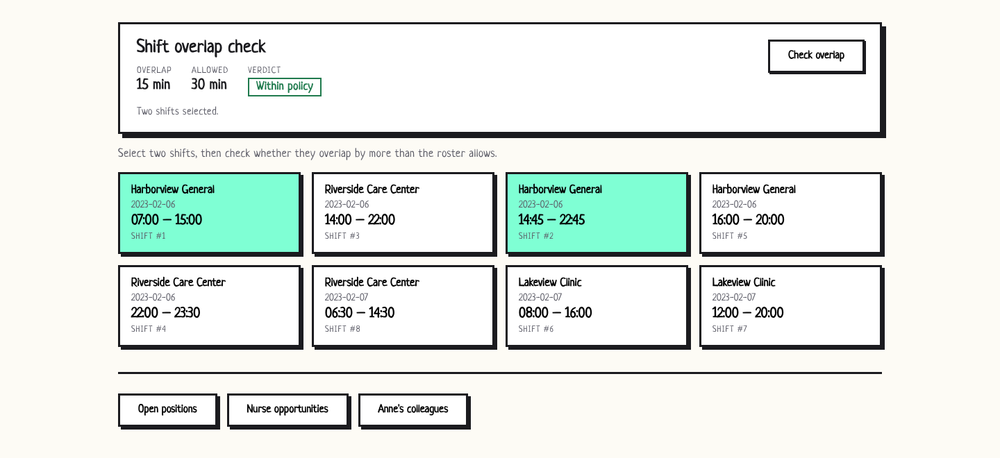
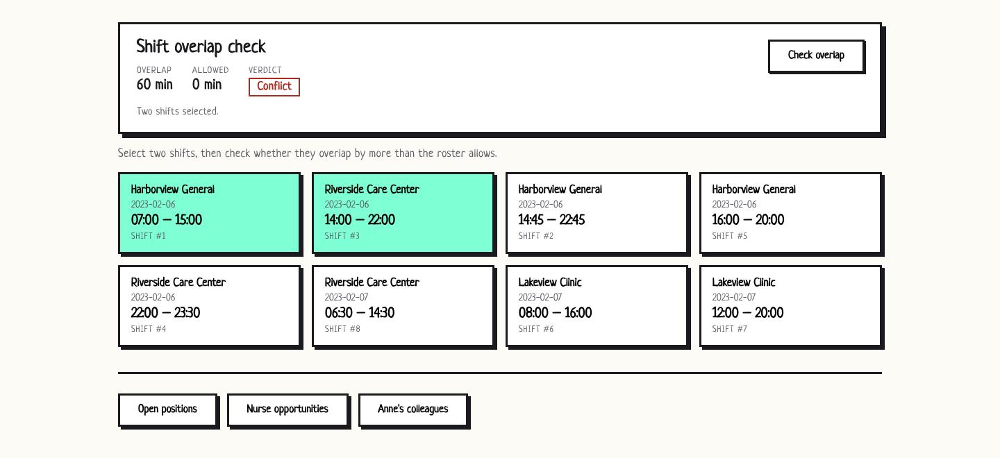
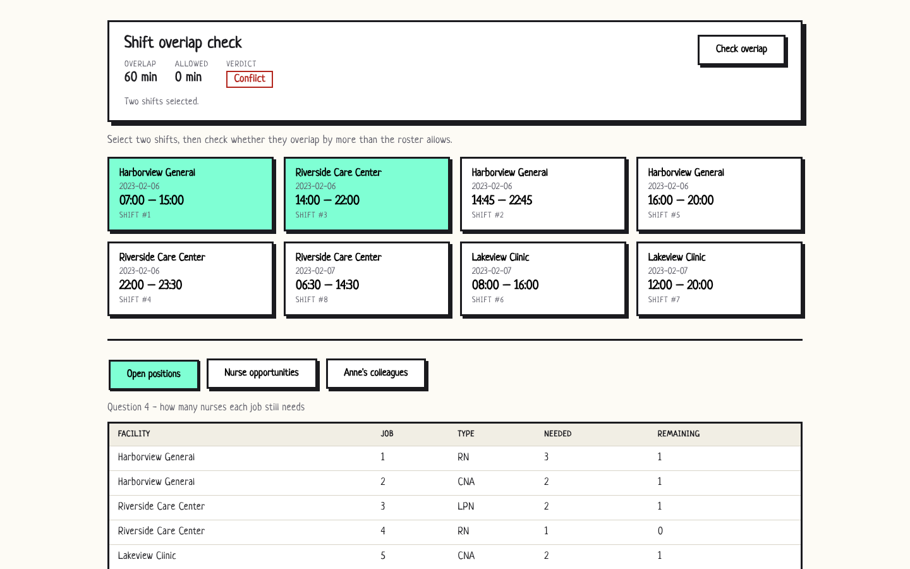
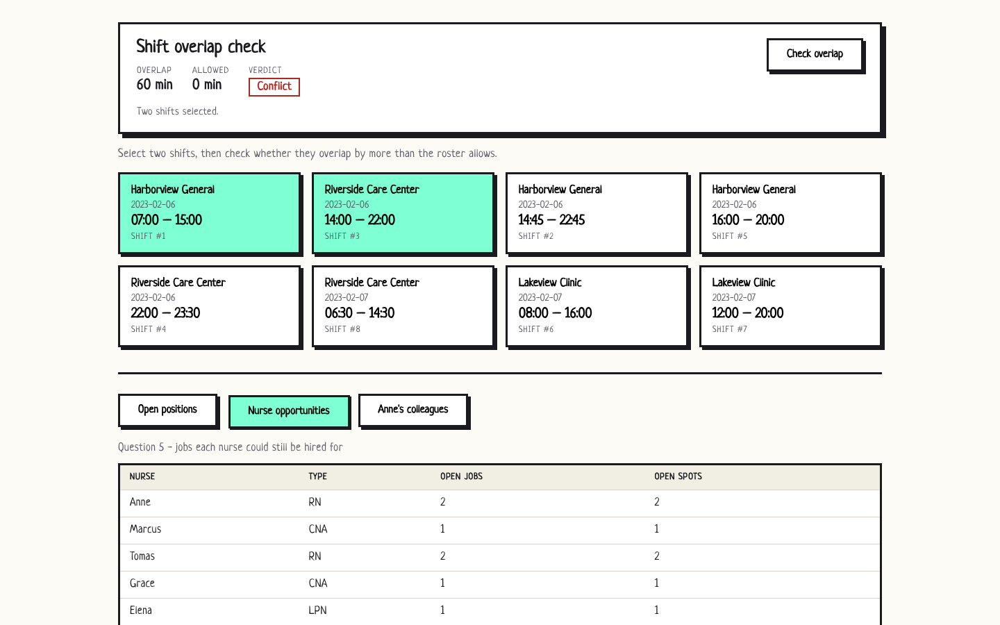
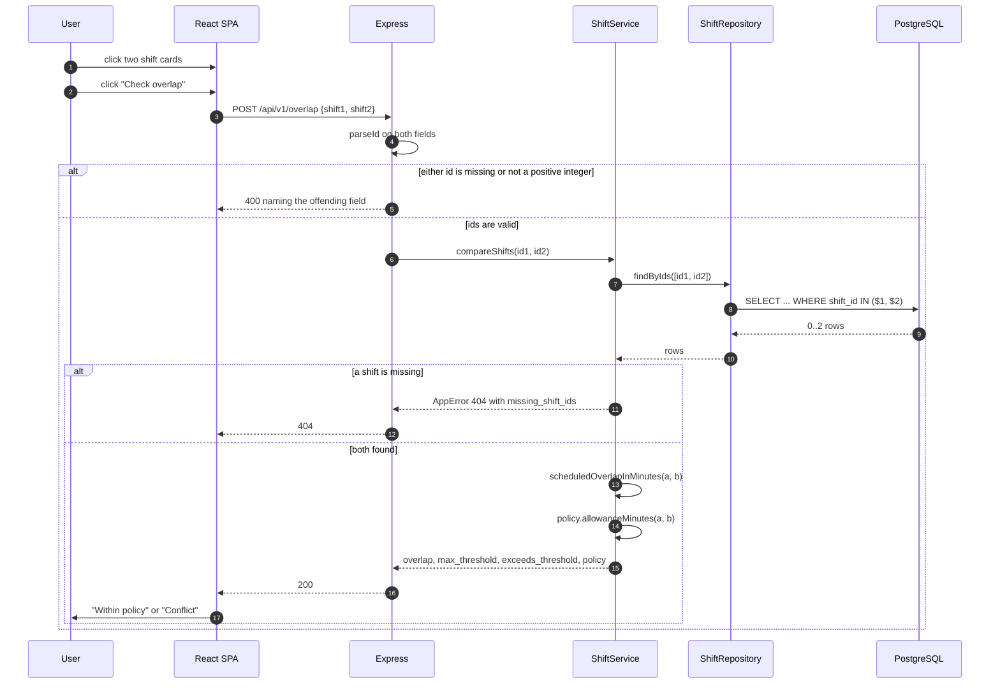
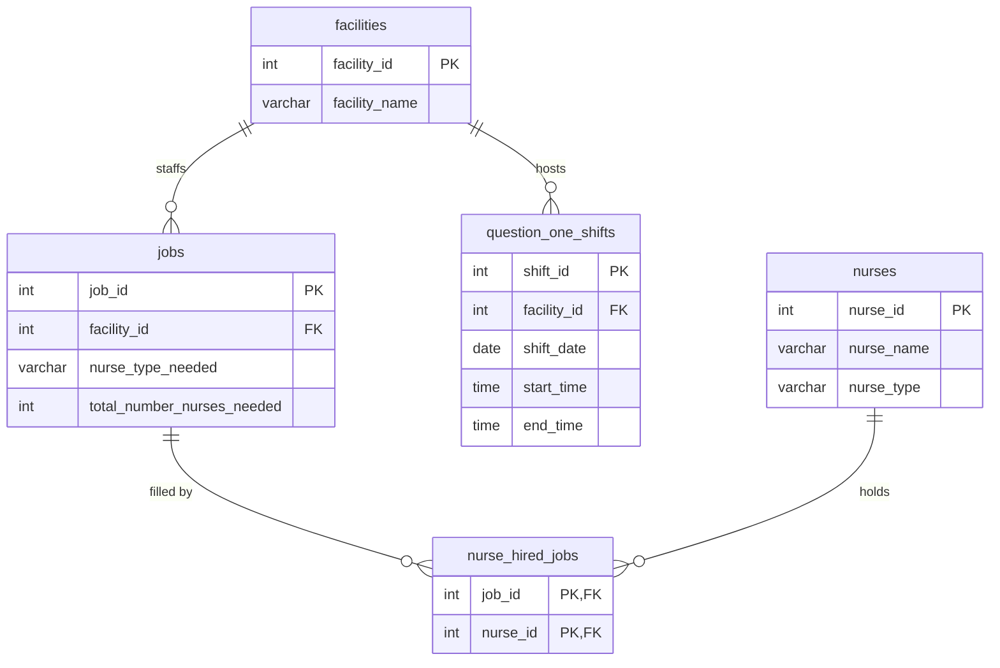

# bravocare — shift overlap and staffing

Two nurses, two scheduled shifts: do they clash? This is a full-stack answer to
that question, plus three staffing queries about open jobs and who can fill
them. An Express + Prisma API over PostgreSQL holds the rule, a React SPA drives
it, and the endpoints are still named after the exercise's question numbers so
an answer maps back to the question it answers.

The rule itself is short. Two shifts at the **same** facility may overlap by up
to a 30 minute handover — the outgoing and incoming nurse hand the ward over in
person. Two shifts at **different** facilities may not overlap at all, because
nobody can be in two buildings at once. Both allowances are env vars, and the
rule as a whole is swappable (see [Swapping the rule](#swapping-the-rule)).

## Seeing it work

Captured with Playwright against the seeded demo database. The first two shots
are 1440x660 — a 1440-wide viewport trimmed below the last control, so the whole
page is there with the empty space cut off. The last two are the full 1440x900.

Two Harborview General shifts overlapping by 15 minutes. That is inside the
30 minute handover, so the verdict is **Within policy**:



Swap the second pick for a Riverside Care Center shift and the same kind of
overlap — 60 minutes, across two facilities — becomes a **Conflict** against an
allowance of zero:



Question 4, how many nurses each open job still needs:



Question 5, the jobs each nurse is still eligible for:



Real request/response pairs for every endpoint, including the 400 and 404 cases,
are captured in [docs/api-examples.md](docs/api-examples.md).

## Run it

With Docker — one command brings up Postgres, applies both migrations, loads the
seed, then starts the API and the client:

```sh
cp .env.example .env          # optional; compose reads POSTGRES_PASSWORD,
                              # CORS_ORIGIN and REACT_APP_API_BASE_URL if set
docker compose up --build
```

The client lands on <http://localhost:8600>, the API on <http://localhost:8601>.
The `migrate` service is a one-shot that the API waits on.

Without Docker you need a PostgreSQL 14+ instance and Node 18+:

```sh
# API
cp .env.example .env          # point DATABASE_URL at your database
npm install
npm run db:migrate            # apply both migrations
npm run db:seed               # load the synthetic demo data
npm start                     # http://localhost:3000

# Client, in a second terminal
cd client
cp .env.example .env.local    # REACT_APP_API_BASE_URL + PORT
npm install
npm start                     # http://localhost:3001
```

## What the API answers

| Method | Path                          | Question | Notes                                                      |
| ------ | ----------------------------- | -------- | ---------------------------------------------------------- |
| `GET`  | `/health`                     | –        | Liveness probe; the container healthcheck curls it.        |
| `GET`  | `/api/v1/question_one_shifts` | 1        | Paged roster with facility names. `limit`, `offset`.       |
| `POST` | `/api/v1/overlap`             | 1        | Body `{shift1, shift2}`. Returns the overlap and verdict.  |
| `GET`  | `/api/v1/q4`                  | 4        | Open positions per job. `limit`, `offset`.                 |
| `GET`  | `/api/v1/q5`                  | 5        | Jobs each nurse can still take. `limit`, `offset`.         |
| `GET`  | `/api/v1/q6`                  | 6        | Nurses sharing a facility with `?nurse=` (default `Anne`). |

`q4`/`q5`/`q6` are kept as the brief numbered them. Renaming them to REST nouns
would make the answers harder to map back to the questions they answer.

## From click to verdict



Both shifts come back in **one** query, not two — `tests/unit/shiftService.test.js`
has a test named "both shifts are fetched in a single query" that holds it there.
`src/app.js` takes its services as an argument, so the HTTP suite builds the
whole Express stack over in-memory repositories with no database running.

## The five tables



`nurse_hired_jobs` is the join table question 5 works against: a nurse is
eligible for a job when `nurse_type` matches `nurse_type_needed` and no row
already pairs them.

The first migration (`20230116215257_new`) creates these tables with no foreign
keys and no indexes beyond the primary keys. The second
(`20230120000000_add_indexes_and_foreign_keys`) adds both — PostgreSQL indexes a
primary key automatically but never a foreign key column, and every staffing
query joins or filters on one. The same migration cleans up orphan rows first,
so it applies to a database that already has data.

## Why question 5 has to paginate inside the query

Question 5 pairs every nurse with every job of their type. On a synthetic
50,000-nurse dataset that is hundreds of millions of candidate pairs, and the
indexes above barely dent it — the cost is the join, not the lookup.

[docs/benchmarks.md](docs/benchmarks.md) records the `EXPLAIN (ANALYZE)` runs.
Three variants of the same query, same dataset, three runs each:

| Variant                            | Execution time     |
| ---------------------------------- | ------------------ |
| Unpaginated, no indexes            | 92,664 – 94,413 ms |
| Unpaginated, with the indexes      | 79,451 – 80,743 ms |
| 50-nurse page taken inside the query | 312.2 – 315.1 ms |

That last row is why `findNurseOpportunities` takes `{ limit, offset }` and
pushes them into a `nurse_page` CTE **before** the join rather than slicing the
result afterwards. Slicing afterwards would have measured the same 80 seconds.
`MAX_PAGE_SIZE` exists so a caller cannot ask for the unpaginated form at all;
an oversized `limit` is clamped, not rejected.

`COUNT` and `SUM` return `bigint`, which reaches JSON as a *string*, so both
aggregates are cast with `::int` in the SQL where the type belongs.

## Two things the clock gets wrong

Interval arithmetic on a roster has two traps, and both have a named test in
`tests/unit/overlap.test.js`:

- **Prisma maps a `TIME` column to a Date pinned to 1970-01-01 UTC.** Read it
  with `getHours()` and every shift shifts by the machine's timezone offset.
  `overlap.js` uses the UTC accessors; the test is "minutesSinceMidnight reads
  the UTC wall clock, not the local one".
- **A shift whose end is not after its start is a night shift.** 22:00–06:00
  ends the next day, so its end is pushed forward a day before comparison.
  Without that every night shift reports zero overlap against everything. Tests:
  "toInterval pushes an overnight end time into the next day" and "an overnight
  shift overlaps the next morning's shift".

Each shift's times are relative to its own `shift_date`, so the second shift is
translated onto the first's day before the intervals meet. That is what lets a
22:00 Monday shift collide with a 05:00 Tuesday one.

## Swapping the rule

The 30/0 minute handover lives in `src/domain/overlapPolicy.js` as a named
policy built from a registry, not as a branch inside the service. Two are
registered: `handover` (the default, described at the top) and `strict`, which
allows no overlap anywhere.

A customer with a 15 minute handover changes
`SAME_FACILITY_OVERLAP_ALLOWANCE_MINUTES`. A customer whose rule depends on
ward, travel time or nurse grade registers a policy and injects it into
`ShiftService` — `tests/unit/shiftService.test.js` does exactly that in "an
injected policy replaces the default rules". This is the one extension point the
exercise implies, so it is the only one built.

## Settings

API, read from `.env` in the repository root:

| Variable                                   | Default       | Purpose                                                                               |
| ------------------------------------------ | ------------- | ------------------------------------------------------------------------------------- |
| `DATABASE_URL`                             | **required**  | PostgreSQL connection string used by Prisma.                                          |
| `PORT`                                     | `3000`        | Port the API listens on.                                                              |
| `NODE_ENV`                                 | `development` | `test` silences request logging; `development` adds a `debug` field to 500 responses. |
| `CORS_ORIGIN`                              | `*`           | Browser origin allowed to call the API.                                               |
| `LOG_FORMAT`                               | `dev`         | morgan format: `dev`, `combined`, `common`, `short`, `tiny`.                          |
| `SAME_FACILITY_OVERLAP_ALLOWANCE_MINUTES`  | `30`          | Handover minutes two shifts at one facility may share.                                |
| `CROSS_FACILITY_OVERLAP_ALLOWANCE_MINUTES` | `0`           | Minutes two shifts at different facilities may share.                                 |
| `DEFAULT_PAGE_SIZE`                        | `50`          | Page size when a request sends no `limit`.                                            |
| `MAX_PAGE_SIZE`                            | `200`         | Ceiling on `limit`; larger values are clamped.                                        |

An integer variable that will not parse throws at startup rather than silently
falling back.

Client, read from `client/.env.local`: `REACT_APP_API_BASE_URL` (default
`http://localhost:3000/api/v1/`, trailing slash included) and `PORT` (the
example ships `3001` so the dev server does not collide with the API). Create
React App inlines `REACT_APP_*` at build time, which is why the client
Dockerfile takes the URL as a build argument.

## Working on it

```sh
npm run dev           # API with nodemon
npm test              # server suite: node:test + supertest
npm run test:client   # client suite: Jest + React Testing Library
npm run lint          # ESLint over server, seed, tests and client
npm run format        # Prettier
npm run db:seed       # reload the synthetic demo data
```

Both suites run offline and need no database. The server tests build the Express
app over in-memory repositories; the client tests replace `ShiftsService` with a
module mock, so no HTTP request leaves the process.

Under the hood the API is routes → controllers → services → repositories, with a
dependency-free domain layer (`overlap.js`, `overlapPolicy.js`) underneath that
knows nothing about Express or Prisma. Every handler is wrapped so a rejected
promise reaches one error middleware; known failures carry their status on an
`AppError` and anything else becomes a flat 500 with no internals in it.

## Known gaps

- **The original brief is not in the repository.** The endpoints are named after
  questions 1, 4, 5 and 6; there is no trace of 2 and 3, which were most likely
  the schema and the data load that `prisma/migrations` already covers. An
  inference, not a fact.
- **No authentication or authorisation.** Every endpoint is public.
- **No write endpoints.** Shifts, jobs and hires arrive via migrations or the
  seed. There is no way to create or edit a roster through the API.
- **Overlap is pairwise.** The API compares two shifts. It does not sweep a
  whole roster for conflicts, which would want an interval tree or a `tstzrange`
  exclusion constraint rather than an endpoint.
- **Shifts have no timezone.** `shift_date` plus a local `TIME` is ambiguous
  across daylight-saving transitions. `tstzrange` would fix it and would change
  the schema the brief supplied.
- **`GET /api/v1/q6` is not paginated.** Its result is bounded by one nurse's
  facilities, but a nurse attached to very many would return a large response.
- **`OFFSET` pagination degrades on deep pages.** Fine at this scale; keyset
  pagination is the fix if it ever matters.
- **The Docker images have not been built here.** `Dockerfile`,
  `client/Dockerfile` and `docker-compose.yml` are written to a normal standard
  — multi-stage, non-root runtime users, healthchecks — and `docker compose
  config` parses cleanly, but no image has been built or booted in this
  environment.
- **All data in the repository is synthetic.** `prisma/seed.js` holds three
  invented facilities and seven first names. There is no real patient, nurse or
  facility information anywhere in the tree.
